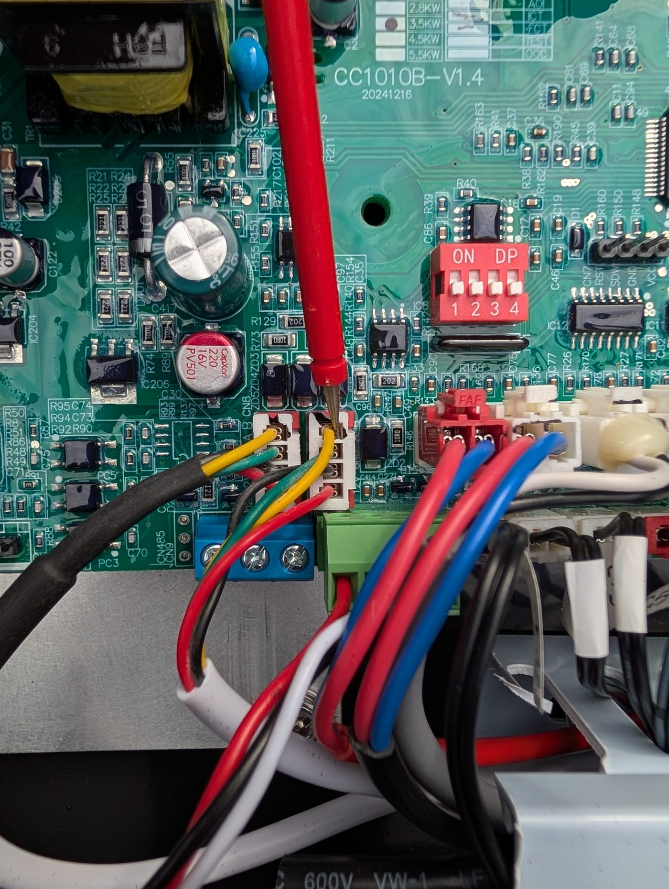
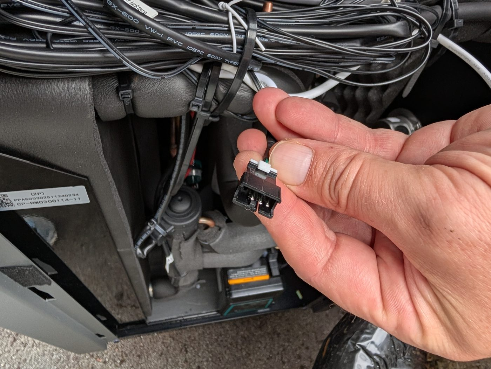

# ioBroker Heat Pump Modbus Adapter

Independent community adapter for local monitoring and control of compatible heat pumps using Modbus RTU.

Developed and maintained by **Helge Kaiser**.

## Current compatibility

The adapter was developed and tested on real hardware with:

- **SWD WP6 R290**
- Modbus RTU
- transparent TCP-to-RS485 gateway

The register mapping and write behaviour are based on the available Modbus documentation and verified against the real bus traffic of the tested system.

The current profile maps **58 Modbus register addresses**:

- 41 read-only register addresses
- 17 read/write register addresses

Several registers contain multiple flags or logical states, so the number of ioBroker states is higher than the number of physical Modbus registers.

Heat pumps using the same or a closely related controller and Modbus protocol may also work. Compatibility with other devices is not guaranteed until verified on real hardware.

Reports about additional compatible models and firmware versions are welcome.

## Independent project

This is an independent open-source community project.

It is not an official product of SWD, Power World, or any other heat-pump manufacturer and is not affiliated with, endorsed by, or supported by those manufacturers.

Manufacturer and product names are mentioned only to describe tested or potentially compatible hardware.

## Operating principle

The adapter is designed primarily as a **passive Modbus RTU listener**.

The heat-pump controller already continuously exchanges Modbus data on its internal RS485 bus. The adapter uses these existing telegrams instead of generating periodic read requests itself.

Therefore:

- no active polling is performed by the adapter
- no fallback polling is used
- valid passive register values are processed immediately
- ioBroker states are only updated when their decoded value changes
- `info.connection` is based on receiving valid Modbus traffic

This minimizes additional traffic on the existing controller bus.

## Connection

The adapter supports two Modbus RTU connection methods.

### TCP/IP to RS485 gateway

This is the currently verified connection method.

The gateway must operate as a **transparent TCP-to-RS485 serial server**.

Required settings:

- TCP Server mode
- 9600 baud
- 8 data bits
- parity: none
- 1 stop bit
- flow control: none
- protocol: none / transparent

The adapter sends and receives complete Modbus RTU frames including CRC.

Do **not** enable Modbus TCP-to-RTU protocol conversion.

A Waveshare Ethernet-to-RS485 gateway has been used successfully during development and is therefore a tested example. Equivalent transparent TCP-to-RS485 gateways should also work.

For the tested Waveshare setup, an **RS485 Conflict Time Gap of 5 ms** is used.

### USB / Serial

Direct USB-to-RS485 adapters are supported through a Linux serial device, for example:

`/dev/ttyUSB0`

or

`/dev/ttyACM0`

The serial parameters are fixed:

- 9600 baud
- 8 data bits
- parity: none
- 1 stop bit
- no flow control

USB / Serial support is implemented but has not been tested as extensively as the transparent TCP connection.

## Safety and liability

> [!CAUTION]
> **USE AT YOUR OWN RISK.**
>
> This adapter communicates with heating equipment and can modify operating
> modes, temperatures, pump parameters and other device settings.
>
> Incorrect wiring, configuration, incompatible hardware, software errors or
> unintended write operations may cause malfunction, loss of heating or hot
> water, overheating, increased energy consumption, damage to the heat pump or
> connected equipment and, in extreme cases, consequential damage including
> fire, property damage, serious injury or death.
>
> No guarantee is given for compatibility, correctness, availability or safe
> operation with any particular installation.
>
> The software is provided "as is", without warranty. Use is at your own risk.
> Liability is limited to the maximum extent permitted by applicable law.
>
> Manufacturer documentation, electrical safety regulations and all protective
> functions of the heat pump always take precedence over this documentation.
> Electrical work and modifications to heating equipment must only be carried
> out by suitably qualified persons.

## RS485 connection

> [!WARNING]
> **Do not assume that every RS485 connector in the heat pump carries the same bus.**
>
> The connection described below is the internal RS485 bus observed on the
> tested SWD WP6 R290 built in 2026.
>
> Wiring, connector type and signal assignment may differ on other production
> years, controller revisions or related heat-pump models.

### Main controller connection

On the tested SWD WP6 R290 built in 2026, the internal RS485 connection is available at the main controller connector shown below.

The tested wiring uses:

- **Yellow and green:** the two RS485 data lines
- **Black:** GND
- GND was not required for successful operation in the tested installation

The exact assignment of yellow/green to A/B is intentionally not specified here.

Verify the A/B assignment on the particular unit before connecting the adapter.

Do not rely solely on wire colours because wiring may differ between production revisions.

### Internal cable splice / service connector

On the tested unit there is also an internal splice in the cable harness leading to the connector shown below. The RS485 data lines can be accessed there.

This arrangement was observed on an **SWD WP6 R290 built in 2026**.

It may not exist, or may be wired differently, on other production versions.

## Bus and write safety

Passive monitoring itself does not transmit anything to the Modbus bus.

A transmission is only generated when an ioBroker state marked as writable is changed with `ack=false`.

Writes are deliberately conservative:

- only one Modbus write is active at a time
- queued changes for the same state keep only the newest requested value
- if the last passively observed device value already equals the requested value, no write is sent
- the adapter waits for at least **200 ms of bus inactivity** before transmitting
- writable registers are sent using Modbus function code **06**
- after a write, confirmation is obtained from the following passive device traffic
- up to the next **two passive observations** of the affected register are accepted as confirmation
- if the device has not accepted the value, the write may be retried
- a maximum of **three actual write attempts** is made
- `ack=true` is only set after the requested value has been observed passively from the device
- after final failure, the last passively observed real device value is restored in ioBroker

For registers containing several bit flags, unrelated bits are preserved using the latest passively observed raw register value.

## Main control states

`R` means read-only.

`RW` means read and write.

> [!WARNING]
> Writable states directly influence the heat pump.
> Only use them when the connected model and register mapping have been verified.

| Address  | State                    | Access | Description                   | Values / range                                                         |
| -------- | ------------------------ | :----: | ----------------------------- | ---------------------------------------------------------------------- |
| `0x003F` | `device.power`           |   RW   | Heat-pump controller power    | `true`, `false`                                                        |
| `0x0040` | `frequencyMode.setpoint` |   RW   | Compressor operating strategy | `smart`, `silent`, `powerful`                                          |
| `0x0041` | `vacation.enabled`       |   RW   | Vacation mode                 | `true`, `false`                                                        |
| `0x0043` | `operatingMode.setpoint` |   RW   | Operating mode                | `hotWater`, `heating`, `cooling`, `hotWaterHeating`, `hotWaterCooling` |
| `0x00BE` | `hotWater.setpoint`      |   RW   | Domestic hot-water setpoint   | 28–60 °C                                                               |
| `0x00BF` | `cooling.setpoint`       |   RW   | Cooling setpoint              | 7–30 °C                                                                |
| `0x00C0` | `heating.setpoint`       |   RW   | Heating setpoint              | 15–50 °C                                                               |
| `0x00D0` | `vacation.setpoint`      |   RW   | Vacation temperature setpoint | 15–50 °C                                                               |

## Water-pump controls

The following controller parameters are exposed as writable states.

| Address  | State                           | Access | Description                     | Values / range                       |
| -------- | ------------------------------- | :----: | ------------------------------- | ------------------------------------ |
| `0x015B` | `pump.constantTemperatureMode`  |   RW   | Constant-temperature pump mode  | `intermittent`, `continuous`, `stop` |
| `0x015C` | `pump.constantTemperatureCycle` |   RW   | Constant-temperature pump cycle | 1–120 min                            |
| `0x015F` | `pump.mode`                     |   RW   | DC water-pump mode              | `disabled`, `automatic`, `manual`    |
| `0x0160` | `pump.adjustmentCycle`          |   RW   | Pump adjustment cycle           | 10–100 s                             |
| `0x0161` | `pump.manualSpeed`              |   RW   | Manual pump speed               | 10–100 %                             |
| `0x0162` | `pump.maxSpeed`                 |   RW   | Maximum pump speed              | %, controller-specific range         |
| `0x0163` | `pump.minSpeed`                 |   RW   | Minimum pump speed              | 10–100 %                             |
| `0x0164` | `pump.adjustmentStep`           |   RW   | Pump adjustment speed           | controller-specific range            |
| `0x0165` | `pump.pwmFrequencyType`         |   RW   | PWM input frequency type        | controller-specific value            |

For `pump.maxSpeed`, `pump.adjustmentStep` and `pump.pwmFrequencyType`, the available Modbus documentation identifies the registers as writable but does not provide a reliable value range or enum definition.

The adapter therefore does not invent undocumented limits or enum meanings for those values.

## Constant-temperature pump operation (F02 / F03)

The heat-pump controller provides two parameters that define how the water
pump behaves after the requested constant temperature has been reached.

These parameters are separate from `pump.mode` (F04).

### F02 - Water pump constant-temperature operation mode

State:

`pump.constantTemperatureMode`

Register:

`0x015B`

The available modes are:

| Raw value | State value    | Behaviour                                                                     |
| :-------: | -------------- | ----------------------------------------------------------------------------- |
|    `0`    | `intermittent` | Pump operates intermittently after the requested temperature has been reached |
|    `1`    | `continuous`   | Pump continues running after the requested temperature has been reached       |
|    `2`    | `stop`         | Pump stops after the requested temperature has been reached                   |

In other words:

- **Intermittent**: the pump is periodically restarted after reaching the target temperature.
- **Continuous**: the pump continues to run even after the target temperature has been reached.
- **Stop**: the pump stops when the target temperature has been reached.

### F03 - Water pump constant-temperature cycle

State:

`pump.constantTemperatureCycle`

Register:

`0x015C`

Range:

`1–120 min`

F03 is relevant when F02 is set to `intermittent`.

According to the manufacturer description, for example:

`F03 = 15`

means:

- pump OFF for 15 minutes
- pump ON for 3 minutes
- the cycle is then repeated as required by the controller

### Observed values on the tested SWD WP6 R290

The following values have been observed passively on the real Modbus bus:

- `0x015B = 1` -> `continuous`
- `0x015C = 15` -> 15-minute intermittent cycle setting

The value of F03 remains stored even when F02 is currently set to
`continuous`. It only becomes relevant for pump operation when F02 is changed
to `intermittent`.

> [!IMPORTANT]
> F02 and F03 must not be confused with `pump.mode`.
>
> `pump.mode` is F04 / register `0x015F` and controls the basic DC water-pump
> mode:
>
> - `disabled`
> - `automatic`
> - `manual`
>
> F02/F03 instead define what the pump should do when the requested constant
> temperature has been reached.

## Temperature states

| State                               | Access | Description                              | Unit |
| ----------------------------------- | :----: | ---------------------------------------- | ---- |
| `temperature.inlet`                 |   R    | Inlet water temperature / return         | °C   |
| `temperature.outlet`                |   R    | Outlet water temperature / flow          | °C   |
| `temperature.tank`                  |   R    | Water-tank temperature                   | °C   |
| `temperature.outside`               |   R    | Outside temperature                      | °C   |
| `temperature.suctionGas`            |   R    | Suction-gas temperature                  | °C   |
| `temperature.evaporator`            |   R    | External-coil / evaporator temperature   | °C   |
| `temperature.innerCoil`             |   R    | Inner-coil temperature                   | °C   |
| `temperature.exhaustGas`            |   R    | Discharge / exhaust-gas temperature      | °C   |
| `temperature.heatSink`              |   R    | Inverter heat-sink temperature           | °C   |
| `temperature.lowPressureConversion` |   R    | Temperature calculated from low pressure | °C   |

## Compressor, fan and pump monitoring

| State                        | Access | Description                                        | Unit |
| ---------------------------- | :----: | -------------------------------------------------- | ---- |
| `compressor.frequency`       |   R    | Actual compressor frequency                        | Hz   |
| `compressor.targetFrequency` |   R    | Compressor target frequency reported by controller | Hz   |
| `compressor.current`         |   R    | Compressor current                                 | A    |
| `fan.speed1`                 |   R    | Fan 1 speed                                        | rpm  |
| `fan.speed2`                 |   R    | Fan 2 speed                                        | rpm  |
| `pump.speed`                 |   R    | Actual water-pump speed                            | %    |
| `pump.targetSpeed`           |   R    | Water-pump target speed reported by controller     | %    |

`pump.targetSpeed` is not necessarily the actual physical pump speed.

For example, the controller may report a target of 100 % while `pump.speed` reports a considerably lower actual speed.

## Performance values

The following performance values were verified on the tested **SWD WP6 R290**
by correlation with real operating data:

| State                  | Address  | Access | Conversion |
| ---------------------- | :------: | :----: | ---------- |
| `performance.capacity` | `0x0036` |   R    | raw × 2 W  |
| `performance.cop`      | `0x0037` |   R    | raw ÷ 10   |

`performance.capacity` represents the heating/cooling capacity reported by the
controller.

`performance.cop` represents the reported COP/EER.

Several real operating points showed close agreement between the reported
capacity, hydraulic heat output, electrical power and COP.

> [!NOTE]
> The mapping is verified on the tested SWD WP6 R290. Compatibility and scaling
> should still be confirmed on other controller revisions or heat-pump models.

## Hydraulic, pressure and electrical values

| State                      | Access | Description                              | Unit |
| -------------------------- | :----: | ---------------------------------------- | ---- |
| `water.flow`               |   R    | Water flow                               | m³/h |
| `pressure.low`             |   R    | Refrigerant low pressure                 | bar  |
| `expansionValve.main`      |   R    | Main electronic expansion-valve position | P    |
| `expansionValve.auxiliary` |   R    | Auxiliary expansion-valve position       | P    |
| `electrical.dcBusVoltage`  |   R    | DC bus voltage                           | V    |
| `electrical.voltage`       |   R    | Supply voltage                           | V    |
| `electrical.current`       |   R    | Supply current                           | A    |
| `electrical.power`         |   R    | Compressor operating power               | W    |
| `electrical.totalPower`    |   R    | Total operating power                    | W    |

## Output states

These states report controller output requests.

They do not independently prove that the connected component is electrically energized or operating correctly.

| State                       | Access | Description                                     |
| --------------------------- | :----: | ----------------------------------------------- |
| `output.compressor`         |   R    | Compressor output                               |
| `output.fanMotor`           |   R    | Fan-motor output                                |
| `output.fourWayValve`       |   R    | Refrigerant four-way-valve output               |
| `output.chassisHeater`      |   R    | Chassis / base-heater output                    |
| `output.acElectricHeater`   |   R    | Additional space-heating electric-heater output |
| `output.threeWayValve`      |   R    | Hydraulic three-way-valve output                |
| `output.tankElectricHeater` |   R    | Domestic hot-water tank electric-heater output  |
| `output.circulationPump`    |   R    | Circulation-pump output                         |
| `output.crankcaseHeater`    |   R    | Compressor crankcase-heater output              |

## Faults and diagnostics

The adapter passively evaluates the documented controller fault registers:

- `0x0007` through `0x000D`
- `0x001F`
- `0x0020`

Known documented fault bits are translated into fault codes and readable descriptions.

Undocumented inverter fault values are deliberately kept as raw values instead of assigning speculative meanings.

| State                              | Access | Description                                         |
| ---------------------------------- | :----: | --------------------------------------------------- |
| `status.defrosting`                |   R    | Defrost cycle active                                |
| `fault.active`                     |   R    | At least one detected fault is active               |
| `fault.codes`                      |   R    | Active documented fault codes / raw inverter faults |
| `fault.messages`                   |   R    | Human-readable fault information                    |
| `diagnostics.rawWorkingStatus`     |   R    | Raw controller working-status word                  |
| `diagnostics.rawOutputFlags1`      |   R    | Raw output-flags word 1                             |
| `diagnostics.rawOutputFlags2`      |   R    | Raw output-flags word 2                             |
| `diagnostics.rawOutputFlags3`      |   R    | Raw output-flags word 3                             |
| `diagnostics.rawFaultFlag1`        |   R    | Raw fault register `0x0007`                         |
| `diagnostics.rawFaultFlag2`        |   R    | Raw fault register `0x0008`                         |
| `diagnostics.rawFaultFlag3`        |   R    | Raw fault register `0x0009`                         |
| `diagnostics.rawFaultFlag4`        |   R    | Raw fault register `0x000A`                         |
| `diagnostics.rawFaultFlag5`        |   R    | Raw fault register `0x000B`                         |
| `diagnostics.rawFaultFlag6`        |   R    | Raw fault register `0x000C`                         |
| `diagnostics.rawFaultFlag7`        |   R    | Raw fault register `0x000D`                         |
| `diagnostics.rawInverterFaultLow`  |   R    | Raw inverter fault register `0x001F`                |
| `diagnostics.rawInverterFaultHigh` |   R    | Raw inverter fault register `0x0020`                |
| `diagnostics.rawFaultFlags`        |   R    | Combined raw fault-register overview                |

## Adapter status

| State             | Access | Description                            |
| ----------------- | :----: | -------------------------------------- |
| `info.connection` |   R    | Valid Modbus traffic is being received |

## Additional registers

The controller exposes many additional service and protection parameters.

Only registers with a sufficiently understood and useful meaning are mapped.
Potentially unsafe or insufficiently documented service settings are
intentionally not exposed.

Still to be verified include:

- SG / Smart Grid signal
- EVU / external utility control
- additional service and protection parameters

## Compatibility reports

If another heat pump uses the same controller or Modbus register layout, please report:

- manufacturer
- model
- controller / firmware version
- which readings work
- which writable functions were successfully tested

This will allow confirmed compatibility information to be added later.

## Changelog

### 0.0.3

- Added passive heating/cooling capacity monitoring at `0x0036`
- Added passive COP/EER monitoring at `0x0037`
- Capacity and COP/EER mapping verified by correlation with real operating data on the tested SWD WP6 R290
- Improved package test configuration for release checks

### 0.0.2

- Added F02/F03 constant-temperature circulation pump control with intermittent, continuous and stop modes and configurable cycle.

- Reworked adapter around passive Modbus RTU monitoring
- Removed active polling and fallback polling
- Simplified write handling
- Writes wait for at least 200 ms of bus inactivity
- Serialized write queue with newest-value replacement for queued states
- Passive write confirmation using up to two subsequent observations
- Maximum of three write attempts
- Added writable vacation temperature setpoint
- Added writable DC water-pump controls `0x015B`, `0x015C` and `0x015F` through `0x0165`
- Corrected `pump.adjustmentCycle` range to 10–100 seconds
- Added passive fault-register monitoring and fault states
- Added raw fault diagnostics
- Preserved unrelated bits for writable shared-bit registers
- Added unsigned 16-bit validation for unrestricted numeric writes

### 0.0.1

- Initial public version
- Modbus RTU communication via transparent TCP-to-RS485 gateway
- Experimental direct USB-to-RS485 support
- Initial monitoring and control support for the tested SWD WP6 R290
- RS485 connection and safety documentation

## License

MIT License

Copyright (c) 2026 Helge Kaiser
